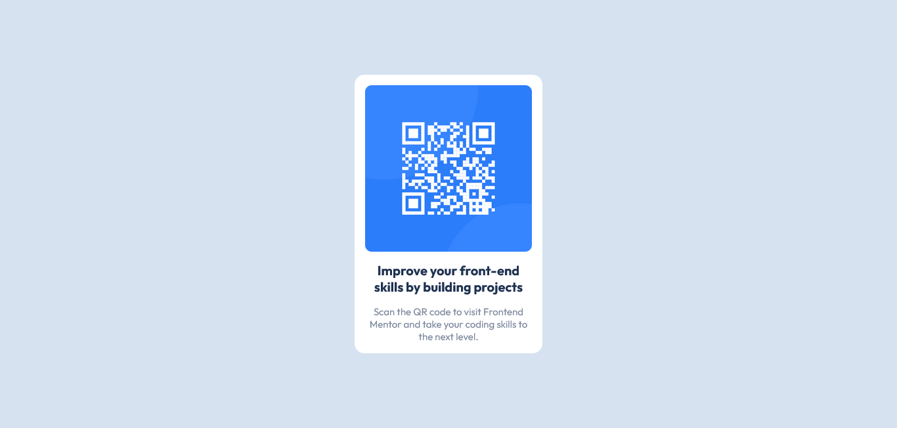

# Frontend Mentor - QR code component solution

This is a solution to the [QR code component challenge on Frontend Mentor](https://www.frontendmentor.io/challenges/qr-code-component-iux_sIO_H). Frontend Mentor challenges help you improve your coding skills by building realistic projects. 

## Table of contents

- [Overview](#overview)
  - [Screenshot](#screenshot)
  - [Link](#link)
- [Built with](#built-with)
- [Author](#author)

## Overview

### Screenshot

### Link

[Demo](https://qr-code-component-keven.netlify.app/)

## Built with

- Semantic HTML5 markup
- CSS custom properties
- Flexbox
- CSS Grid
- Mobile-first workflow
- [React](https://reactjs.org/) - JS library
- [Next.js](https://nextjs.org/) - React framework
- [Styled Components](https://styled-components.com/) - For styles
- [Webpack 5](https://webpack.js.org/)
- [Bebel](https://babeljs.io/)

## Author

- [LinkedIn](https://www.linkedin.com/in/kevenpacheco/)
